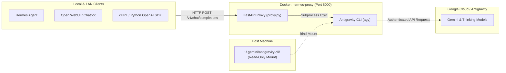

# 🛰️ Hermes Antigravity Proxy

An OpenAI-compatible **FastAPI** proxy running in **Docker** that exposes Google Antigravity LLMs via the `agy` CLI as a local/LAN REST API. 

Seamlessly connect external autonomous agents (like [Hermes](https://github.com/nousresearch/hermes)), web UIs ([Open WebUI](https://github.com/open-webui/open-webui), LibreChat), coding assistants (Continue.dev, Cursor), or standard OpenAI SDKs to your Antigravity models.

---

## 🌟 Key Highlights

- **🔌 OpenAI Compatible**: Drop-in replacement for OpenAI API endpoints (`POST /v1/chat/completions`, `GET /v1/models`, SSE streaming support).
- **⚡ Dynamic Model Discovery**: Queries the `agy` binary at runtime for available models and auto-resolves to the newest available **Gemini Flash (High reasoning)** model (e.g., `gemini-3.7-flash-high`, auto-upgrading to `gemini-3.8-flash-high` when released).
- **🏷️ Virtual Aliases**: Call `latest`, `gemini-flash`, `gemini-flash-high`, `auto`, or `default` to automatically route requests to the best available reasoning model.
- **💬 Intelligent Conversation Flattening**: Converts OpenAI-formatted multi-turn message arrays (`system`, `user`, `assistant`) into structured prompts optimized for non-interactive CLI execution.
- **🧹 ANSI Cleaning**: Strips terminal escape codes and formatting artifacts from responses automatically.
- **🔒 Zero-Credential Storage**: Leverages existing host OAuth credentials (`~/.gemini/antigravity-cli/`) via a read-only volume mount paired with in-memory `tmpfs` overlays for clean ephemeral runtime writes.
- **🚀 Always-On & Production Ready**: Configured with automatic restarts (`restart: unless-stopped`) and built-in CORS for cross-device LAN access.

---

## 🏗️ Architecture



---

## 📋 Prerequisites

Before starting the proxy, ensure the host machine has:

1. **Docker & Docker Compose** installed ([Get Docker](https://docs.docker.com/get-docker/)).
2. **Antigravity CLI (`agy`) Authenticated**:
   Install and run the Antigravity CLI on the host machine at least once so credentials exist in `~/.gemini/antigravity-cli/`:
   ```bash
   # 1. Install agy on your host
   curl -fsSL https://antigravity.google/cli/install.sh | bash

   # 2. Launch agy once to authenticate with your Google account
   agy
   ```

---

## 🚀 Quickstart

### 1. Clone & Start Container

```bash
git clone https://github.com/ankurawl/hermes-proxy.git
cd hermes-proxy
docker compose up -d --build
```

### 2. Verify Health

```bash
curl http://localhost:8000/health
# Response: {"status":"ok","service":"hermes-proxy"}
```

### 3. List Available Models & Aliases

```bash
curl http://localhost:8000/v1/models
```

### 4. Send a Chat Completion Request

**Standard JSON completion:**
```bash
curl -X POST http://localhost:8000/v1/chat/completions \
  -H "Content-Type: application/json" \
  -d '{
    "model": "latest",
    "messages": [
      {"role": "system", "content": "You are a concise AI assistant."},
      {"role": "user", "content": "Explain quantum computing in one sentence."}
    ]
  }'
```

**Streaming response (Server-Sent Events):**
```bash
curl -X POST http://localhost:8000/v1/chat/completions \
  -H "Content-Type: application/json" \
  -d '{
    "model": "latest",
    "stream": true,
    "messages": [
      {"role": "user", "content": "Write a short haiku about Docker."}
    ]
  }'
```

---

## 💻 Client Integration Examples

### 1. Hermes Agent (or any remote agent on LAN / Tailscale)
Configure Hermes to connect to your proxy host:
- **Base URL**: `http://<PROXY_HOST_IP_OR_TAILSCALE_IP>:8000/v1` (or `http://localhost:8000/v1` if local)
- **API Key**: Any dummy string (e.g. `sk-hermes-proxy`)
- **Model**: `latest` (or `gemini-3.7-flash-high`, `gemini-3.1-pro-high`, `claude-sonnet-4-6`)

### 2. Official OpenAI Python SDK
```python
from openai import OpenAI

client = OpenAI(
    base_url="http://localhost:8000/v1",
    api_key="sk-hermes-proxy",  # Dummy key required by SDK
)

response = client.chat.completions.create(
    model="latest",
    messages=[
        {"role": "system", "content": "You are an expert engineer."},
        {"role": "user", "content": "How do Linux cgroups work?"},
    ],
)

print(response.choices[0].message.content)
```

### 3. Open WebUI / LibreChat / Third-Party UIs
- **API Base URL**: `http://localhost:8000/v1` (or host LAN IP)
- **API Key**: `sk-hermes-proxy`
- **Models**: Select `latest`, `gemini-flash-high`, or let the UI fetch dynamically from `GET /v1/models`.

---

## 📂 Repository Structure

- [`proxy.py`](./proxy.py): Core FastAPI proxy service handling OpenAI schemas, dynamic model discovery, subprocess invocation, message flattening, and streaming.
- [`docker-compose.yml`](./docker-compose.yml): Production Docker Compose file with host volume bind mounts and secure `tmpfs` overlays.
- [`Dockerfile`](./Dockerfile): Minimal `python:3.11-slim` container installing `agy` CLI and Python dependencies.
- [`requirements.txt`](./requirements.txt): Pinned dependencies (`fastapi`, `uvicorn`, `pydantic`).
- [`.gitignore`](./.gitignore) & [`.dockerignore`](./.dockerignore): Clean repository hygiene preventing local artifacts or credential leakage.

---

## ⚙️ Configuration & Environment Variables

You can optionally configure the proxy via environment variables in `docker-compose.yml`:

| Variable | Default | Description |
| :--- | :--- | :--- |
| `MODEL_CACHE_TTL` | `1800` | In-memory model discovery cache duration in seconds (30 minutes). |
| `AGY_BIN` | `/root/.local/bin/agy` | Path to the Antigravity CLI binary inside the container. |

---

## 🔧 Management & Troubleshooting

### View Container Logs
```bash
docker compose logs -f hermes-proxy
```

### Updating Models & Dependencies
To pull the latest `agy` binary or update proxy logic:
```bash
docker compose build --no-cache
docker compose up -d
```

### Common Issues

- **Authentication Error / CLI Failure**: Ensure you have run `agy` on your host machine to generate credentials in `~/.gemini/antigravity-cli/`. If using Windows WSL2 or a non-standard home path, check that the volume path in `docker-compose.yml` points to your active `.gemini/` directory.
- **Port Conflict (8000 already in use)**: Change the host port mapping in `docker-compose.yml` (e.g. `"8080:8000"`).
- **Firewall on LAN**: If remote machines cannot reach the proxy, make sure port `8000` is allowed in your host's firewall (`sudo ufw allow 8000/tcp` on Ubuntu/Debian).

---

## 📄 License

MIT License. Feel free to use, modify, and distribute for personal or commercial projects.
